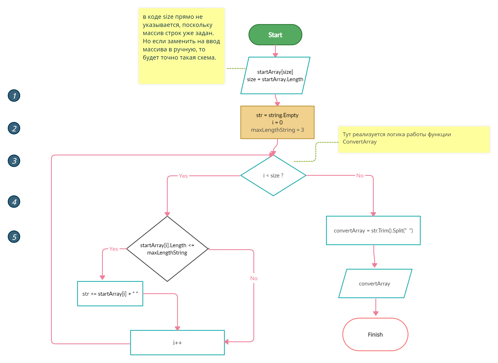

# Итоговая контрольная работа по основному блоку

## Задача: 
Написать программу, которая из имеющегося массива строк формирует новый массив из строк, длина которых меньше, либо равна 3 символам. Первоначальный массив можно ввести с клавиатуры, либо задать на старте выполнения алгоритма. При решении не рекомендуется пользоваться коллекциями, лучше обойтись исключительно массивами.
Примеры:
* ["Hello", "2", "world", ":-)", "Лям"] → ["2”, ":-)", "Лям"]
* ["1234", "1567", "-2", "computer science"] → ["-2"]
* ["Russia", "Denmark", "Kazan"] → []

--------------------------------
## Описание решения:
__Визуально логика решения представленна на блок-схеме:__


### Подробное описание решения:
1. Вручную задаем массив строк разной длинны (с учетом кириллицы) 
    > ```string[] startArray = {"Hello", "2", "world", ":-)", "Лям"};```
2. Затем создали функцию которая передает элементы начального массива только в том случае, если длинна строки не превышает 3 символов.
    > ```string[] ConvertArray(string[] startArray)```   
    - Создаем пустую строку, которую затем будем заполнять строками не превышающими трех сисмвлов
        > ```string str = string.Empty;``` 
    - Во избежания магического числа присваеиваем в переменную **_maxLengthString_** значение 3, т.е. максимальную длинну строк.
        > ```int maxLengthString = 3;```
    -  Создаем цикл **_for_** внутри которого проходим по всему массиву **_startArray_**
        > ```for (int i = 0; i < startArray.Length; i++)```
        + Внтури цикла делаем проверку на длину элементов массива(строк) 
            > ```if (startArray[i].Length <= maxLengthString)``` 
            
            [X] Если длинна строки меньше **_maxLengthString_** то мы заполняем строку **_str_**
            > ``` str += startArray[i] + " ";```
    - Затем у строки str мы удаляем лишние пробелы спереди и сзади, и преобразовываем в массив строк, в качестве сепаратора указываем пробел (" "). Данному массиву мы присваиваем имя **convertArray**.
        > ```string[] convertArray = str.Trim().Split(" ");```
    - Возвращаем новый массив
        > ```return convertArray;```
3. Создаем массив **convertedArray** и присваиваем ему значение вернувшееся из функции **_ConvertArray()_**
    > ```string[] convertedArray = ConvertArray(startArray);```
4. Выводим в консоль массив длина элементов которого не превышает трех символов (из п. 3)
    > ```Console.Write($"[{string.Join(", ", convertedArray)}]");```

